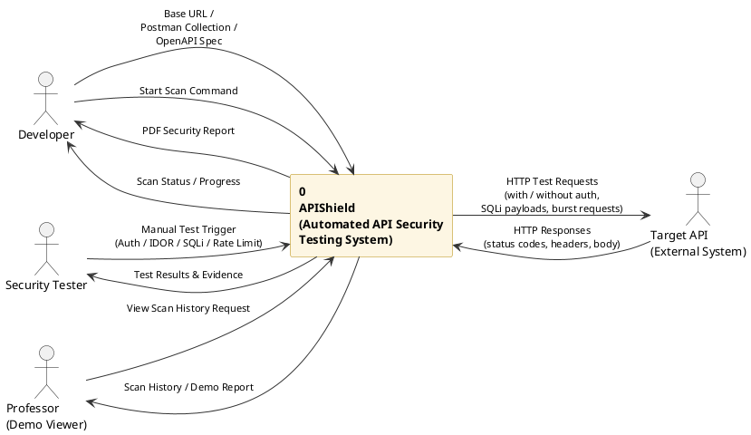
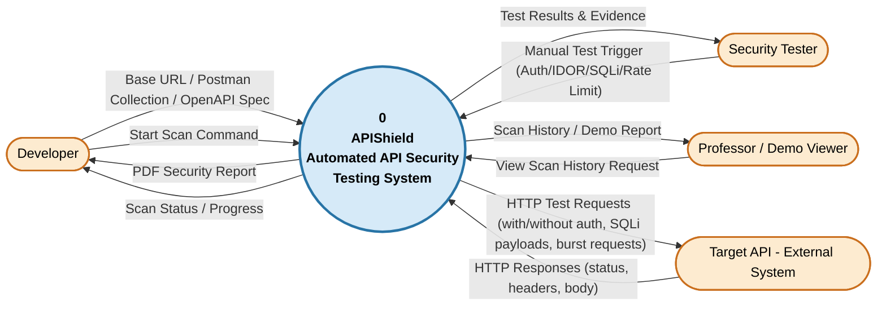

# Diagram 1: Data Flow Diagram (Level 0 — Context Diagram)

## Explanation

The Level 0 DFD (Context Diagram) shows **APIShield** as a single process bubble at the center, with all external entities that interact with it, and the high-level data flows entering and leaving the system. This is the highest level of abstraction — no internal processes and no data stores are broken out individually (the database is represented only implicitly inside the single process, per standard Gane–Sarson/Yourdon convention that Level 0 shows exactly one process). The external entities are the **Developer**, the **Security Tester**, the **Professor (Demo Viewer)**, and the **Target API** (the external REST API being scanned).

## Diagram

## PlantUML Code

## Mermaid Code

## Notes

- **Assumption:** The Database is intentionally *not* shown as a separate entity at Level 0, per standard DFD convention — internal data stores only appear starting at Level 1. It is represented implicitly inside process "0".
- **Assumption:** "Target API" is modeled as an external entity because it is a system *external* to APIShield's boundary, even though APIShield initiates the calls to it (this is standard for systems being tested/monitored).
- The Professor is modeled as a read-only actor (views scan history / demo reports) since the spec describes them as a "Demo Viewer."
- Both PlantUML and Mermaid versions render as a single-process context diagram consistent with Gane-Sarson notation adapted for Mermaid's flowchart engine (Mermaid has no native DFD shape library, so a circle/rounded node is used for the process and stadium shapes for external entities).
- Both code blocks above have been **syntax-validated**: the PlantUML compiles cleanly with PlantUML v1.2024.7, and the Mermaid code passes `mermaid.parse()` with no errors.
