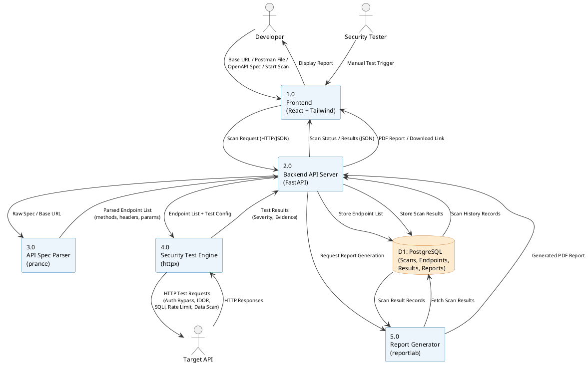
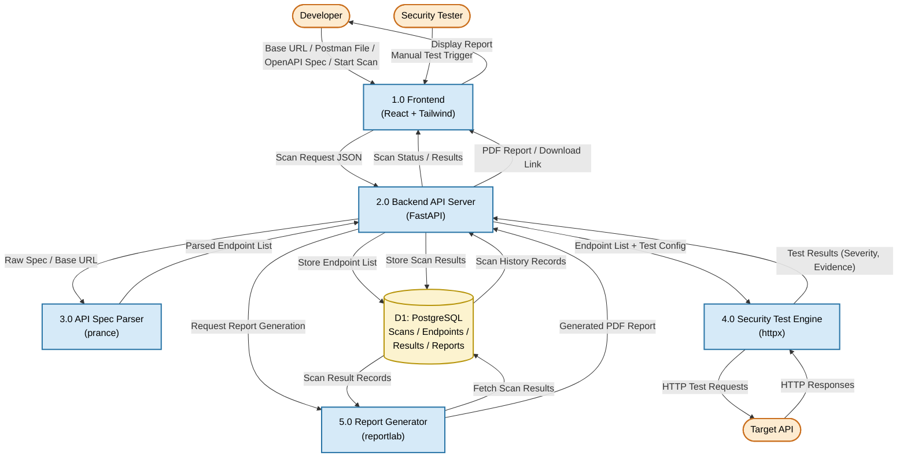

# Diagram 2: Data Flow Diagram (Level 1)

## Explanation

The Level 1 DFD decomposes process "0" (APIShield) from the Context Diagram into its five major internal processes: the **Frontend**, the **Backend API Server**, the **API Spec Parser**, the **Security Test Engine**, and the **Report Generator**. It introduces the single persistent data store, **D1: PostgreSQL**, which holds endpoints, scan results, and report metadata. The diagram traces the full data flow: a developer's input travels from the Frontend, through the Backend, into the Parser for endpoint extraction, then into the Test Engine which talks to the external Target API, with all results persisted to the database and ultimately assembled into a PDF by the Report Generator.

## Diagram

## PlantUML Code

## Mermaid Code

## Notes

- **Assumption:** Processes are numbered 1.0–5.0 in the order data primarily flows through them (Frontend → Backend → Parser → Test Engine → Report Generator), which is standard DFD leveling practice.
- **Assumption:** Only one data store (D1: PostgreSQL) is shown, since the spec describes a single relational database holding all scan-related entities (endpoints, results, reports) rather than separate physical stores.
- The Backend (2.0) acts as the central orchestrator — all inter-process communication and all database writes are routed through it, reflecting the FastAPI backend's role as the system's controller layer.
- Both code blocks are **syntax-validated**: PlantUML compiles cleanly; Mermaid passes `mermaid.parse()` with diagram type `flowchart-v2`.
