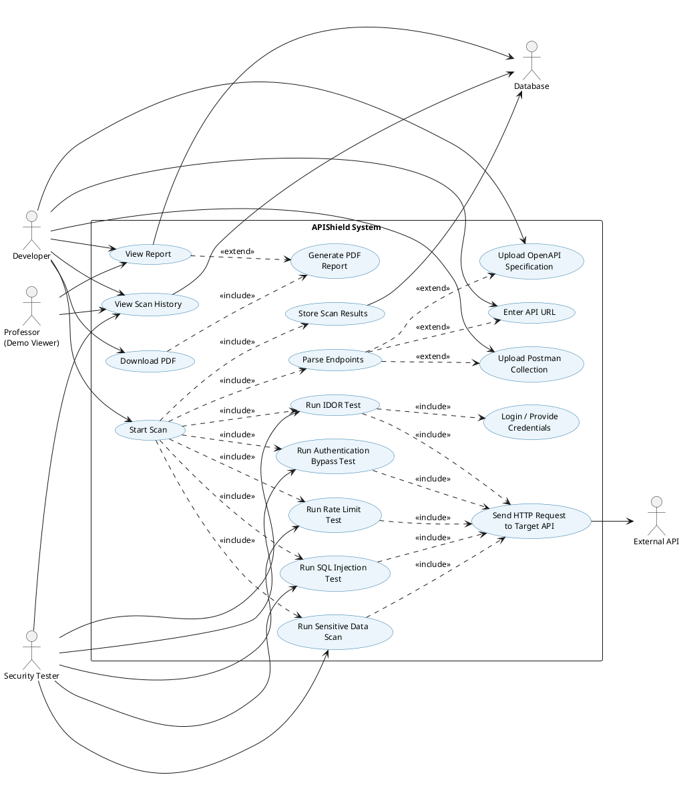
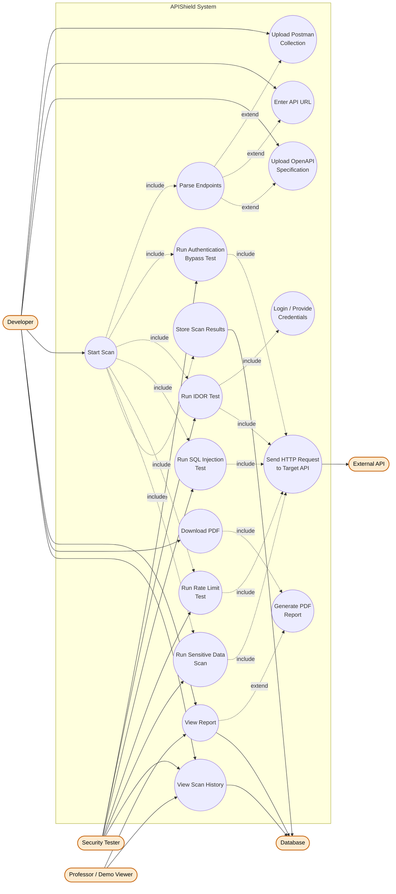

# Diagram 3: Use Case Diagram

## Explanation

This Use Case Diagram captures how the three human actors — **Developer**, **Security Tester**, and **Professor (Demo Viewer)** — interact with APIShield, plus two supporting actors representing external systems the use cases depend on: the **External API** (the target being scanned) and the **Database**. The central "Start Scan" use case `<<include>>`s endpoint parsing and all five security tests, since a scan always requires them. Input-method use cases (Upload Postman, Enter API URL, Upload OpenAPI Spec) are modeled as `<<extend>>` points of "Parse Endpoints" because only one of the three is used per scan, depending on the developer's choice. Viewing a report `<<extend>>`s into report generation only if a PDF hasn't already been generated for that scan.

## Diagram

## PlantUML Code

## Mermaid Code

## Notes

- **Assumption:** "Database" and "External API" are modeled as secondary (system) actors on the use case diagram, per UML convention that any external system a use case interacts with can be shown as an actor, not just human roles.
- **Assumption:** IDOR testing is the only test that explicitly `<<include>>`s a login/credential step, since the spec describes it as requiring "logs in as User A" — the other tests do not require authenticated session setup.
- **Assumption:** "View Report" `<<extend>>`s "Generate PDF Report" rather than always including it, modeling the case where a report may already exist and simply needs to be displayed/fetched.
- Mermaid has **no native use-case-diagram type**; the standard workaround (used above) is a `graph`/`flowchart` with a `subgraph` boundary and circular/stadium nodes to approximate use-case ovals, with dotted edges labeled "include"/"extend" standing in for the `<<include>>`/`<<extend>>` stereotypes. PlantUML supports true use-case notation natively.
- Both code blocks are **syntax-validated**: PlantUML compiles cleanly; Mermaid passes `mermaid.parse()` with diagram type `flowchart-v2`.
