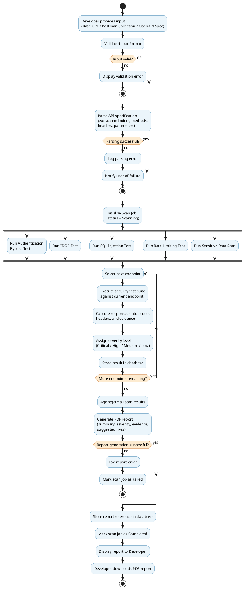
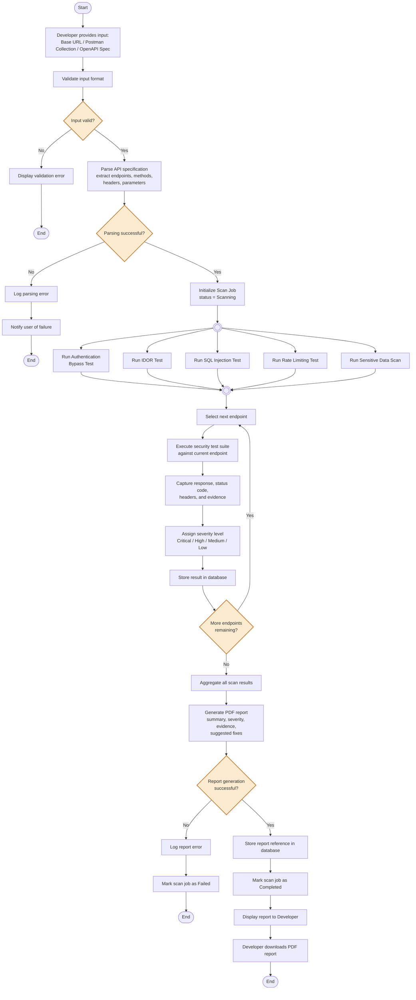

# Diagram 4: Activity Diagram

## Explanation

This Activity Diagram models the complete end-to-end workflow of a single scan, from the developer's initial input through validation, parsing, a **fork** into the five parallel-capable security tests, a **loop** that iterates the full test suite over every discovered endpoint, result storage, PDF report generation, and final display. Two decision points (input validation, parsing success) allow early termination on bad input, and a third decision point governs the report-generation outcome. The fork/join pair represents that the five security tests are conceptually independent checks that could run concurrently against a given request context, while the surrounding loop drives them across the full endpoint list.

## Diagram

## PlantUML Code

## Mermaid Code

## Notes

- **Assumption:** The fork/join block represents the five security tests as *conceptually parallel* activities (they don't depend on each other's output), even though the loop below re-sequences them per endpoint. This satisfies the requirement for "Forks, Joins" in true UML activity notation, which Mermaid approximates using small circular fork/join bar nodes.
- **Assumption:** Three separate terminal (`stop`/`End`) nodes are used for the three distinct failure exits (invalid input, parsing failure, report failure), which is standard UML activity practice — an activity diagram can have multiple final nodes.
- The loop uses PlantUML's native `repeat`/`repeat while` construct (a proper UML loop node), and the Mermaid equivalent uses a conditional back-edge to reproduce the same semantics, since Mermaid flowcharts have no dedicated loop node.
- Both code blocks are **syntax-validated**: PlantUML compiles cleanly; Mermaid passes `mermaid.parse()` with diagram type `flowchart-v2`.
