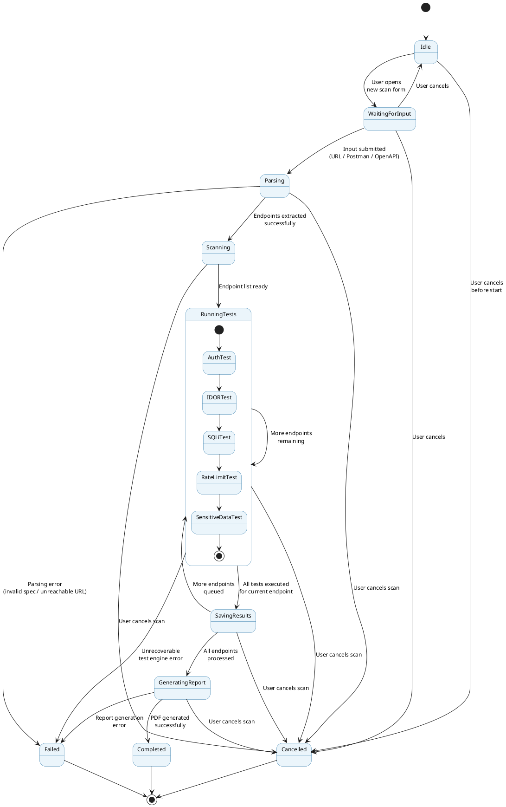
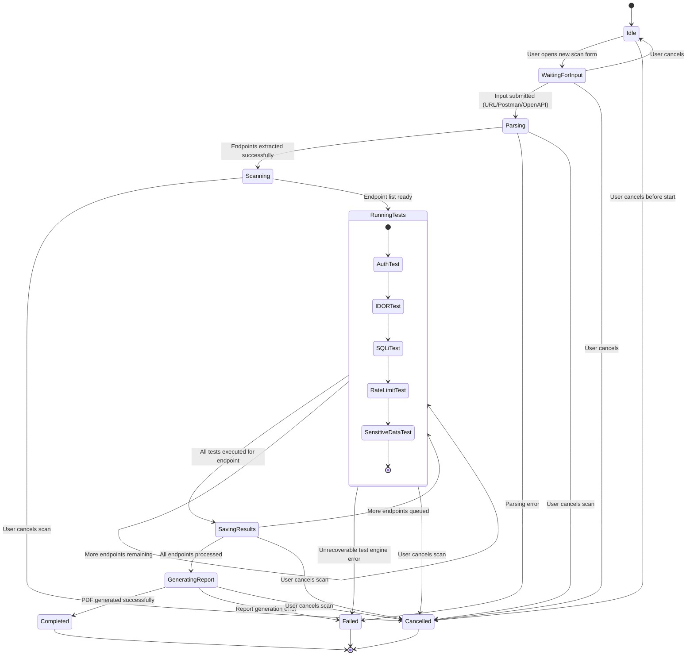

# Diagram 5: State Diagram

## Explanation

This State Diagram models the lifecycle of a single **Scan Job** object, from creation through to its terminal outcome. A scan starts in `Idle`, moves to `WaitingForInput` once a user opens the scan form, then transitions through `Parsing` and `Scanning` before entering the composite state `RunningTests` — an internal sub-state machine representing the five security tests executing in sequence for the current endpoint. From there the job cycles through `SavingResults` (looping back to `RunningTests` if more endpoints remain), then `GeneratingReport`, finally reaching `Completed`. A `Failed` state is reachable from any processing stage on unrecoverable error, and a `Cancelled` state is reachable from any pre-completion state if the user aborts the scan.

## Diagram

## PlantUML Code

## Mermaid Code

## Notes

- **Assumption:** `RunningTests` is modeled as a **composite state** with an internal sub-state-machine (Auth → IDOR → SQLi → RateLimit → SensitiveData) to reflect that the five tests execute sequentially per endpoint within a single higher-level "testing" state, while the outer loop (`RunningTests` → `SavingResults` → `RunningTests`) handles moving between endpoints.
- **Assumption:** `Cancelled` is reachable from every pre-terminal state (`Idle` through `GeneratingReport`) since the spec lists it as a required state but does not specify exactly when cancellation is allowed; modeling it as available throughout the active lifecycle is the safest and most realistic interpretation for a user-facing scan tool.
- `Completed`, `Failed`, and `Cancelled` are all modeled as distinct terminal states feeding into the final state `[*]`, which is valid UML — a state machine may have multiple paths to termination.
- Both code blocks are **syntax-validated**: PlantUML compiles cleanly; Mermaid passes `mermaid.parse()` with diagram type `stateDiagram`.
