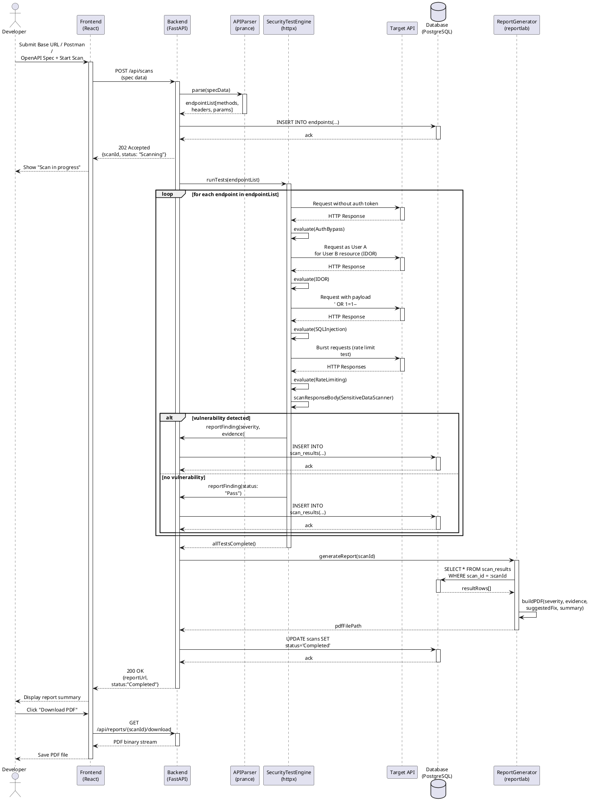
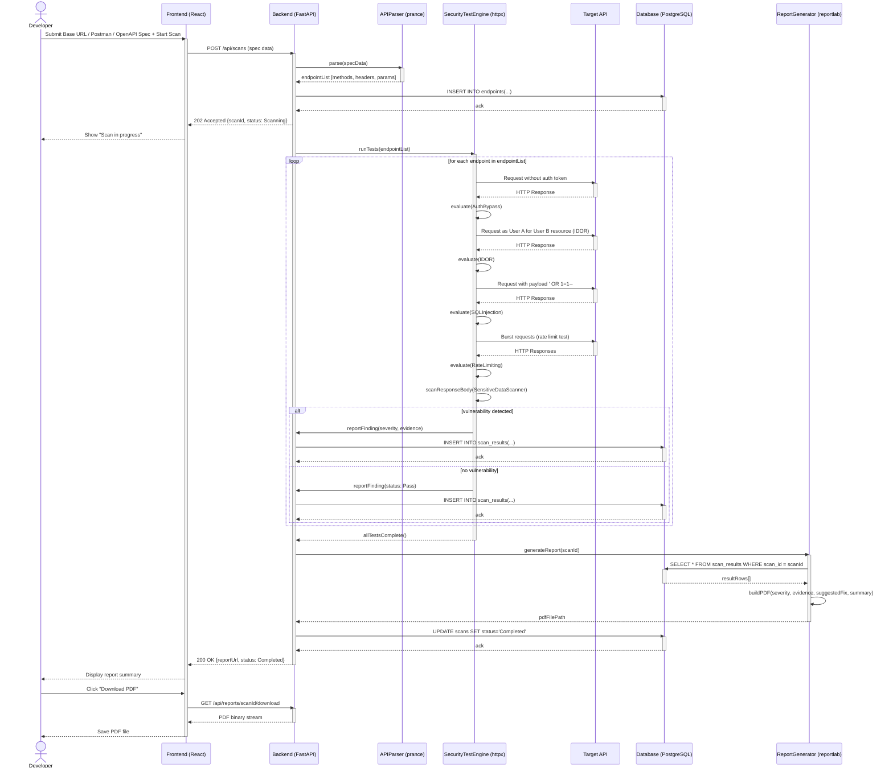

# Diagram 6: Sequence Diagram

## Explanation

This Sequence Diagram traces one complete scan from the Developer's initial request through to PDF download, showing every major object described in the spec: **Developer**, **Frontend**, **Backend**, **APIParser**, **SecurityTestEngine**, the external **Target API**, the **Database**, and the **ReportGenerator**. It uses activation bars to show when each object is actively processing, a `loop` frame to iterate the five security tests over every discovered endpoint, and an `alt`/`else` frame to branch on whether a vulnerability was detected for a given test (storing either a finding or a "Pass" result). Return messages (dashed arrows) are shown for every synchronous call that produces a response.

## Diagram

## PlantUML Code

## Mermaid Code

## Notes

- **Assumption:** All five security tests are shown sequentially *within* the `loop` over endpoints, rather than as five separate top-level loops, since they logically apply per-endpoint (this matches the Activity Diagram's structure and keeps the sequence readable).
- **Assumption:** The `alt`/`else` block is shown once (conceptually applying after each test's evaluation) rather than duplicated five times, to keep the diagram legible while still fully representing the conditional storage behavior described in the spec ("Checks unexpected behavior" / "Checks authorization failures").
- Self-messages (e.g., `TestEngine -> TestEngine : evaluate(...)`) represent internal computation/evaluation steps that do not involve another object, which is standard UML sequence notation for internal logic.
- Both code blocks are **syntax-validated**: PlantUML compiles cleanly; Mermaid passes `mermaid.parse()` with diagram type `sequence`.
