# Diagram 7: Class Diagram

## Explanation

This Class Diagram models the full static structure of APIShield: presentation (`Frontend`), controller (`Backend`), the parsing utility (`APIParser`), the orchestrator (`ScanManager`), an abstract `SecurityTestEngine` base class with five concrete test strategies inheriting from it (`AuthenticationTester`, `IDORTester`, `SQLInjectionTester`, `RateLimitTester`, `SensitiveDataScanner`), the `ReportGenerator`, the `DatabaseManager`, and the domain/data classes `ScanResult`, `Endpoint`, `Report`, and `UserInput`. All four required relationship types are present: **composition** (e.g., `Backend` owns exactly one `ScanManager` for its whole lifecycle — if the Backend is destroyed, so is the manager), **aggregation** (e.g., `DatabaseManager` aggregates many `ScanResult`/`Endpoint`/`Report` records that can conceptually exist independently of the manager object itself), **dependency** (e.g., `Frontend` depends on `Backend` only through transient HTTP calls), and **inheritance** (the five concrete testers extend the abstract `SecurityTestEngine`). Multiplicities are attached to every association/aggregation/composition edge.

## Diagram

## PlantUML Code

```plantuml
@startuml Class_Diagram
skinparam backgroundColor #FFFFFF
skinparam defaultFontName Arial
skinparam defaultFontSize 11
skinparam classAttributeIconSize 0
skinparam class {
  BackgroundColor #EBF5FB
  BorderColor #2874A6
  ArrowColor #333333
}

class Frontend {
  - apiBaseUrl: String
  - currentScanId: String
  + renderUploadForm(): void
  + submitScanRequest(input: UserInput): void
  + displayScanStatus(status: String): void
  + displayReport(report: Report): void
  + downloadPDF(reportId: String): void
}

class Backend {
  - routes: List<Route>
  - scanManager: ScanManager
  + handleScanRequest(input: UserInput): ScanResult
  + handleReportRequest(scanId: String): Report
  + handleHistoryRequest(): List<ScanResult>
}

class APIParser {
  - specSource: String
  - specType: String
  + parseBaseUrl(url: String): List<Endpoint>
  + parsePostmanCollection(file: File): List<Endpoint>
  + parseOpenAPISpec(file: File): List<Endpoint>
  + validateSpec(): boolean
}

class ScanManager {
  - scanId: String
  - status: String
  - endpoints: List<Endpoint>
  + initiateScan(input: UserInput): void
  + updateStatus(newStatus: String): void
  + collectResults(): List<ScanResult>
  + finalizeScan(): void
}

abstract class SecurityTestEngine {
  # httpClient: HTTPClient
  # targetEndpoint: Endpoint
  + {abstract} runTest(endpoint: Endpoint): ScanResult
  + sendRequest(request: HTTPRequest): HTTPResponse
  + logEvidence(response: HTTPResponse): String
}

class AuthenticationTester {
  + runTest(endpoint: Endpoint): ScanResult
  + attemptWithoutToken(endpoint: Endpoint): HTTPResponse
}

class IDORTester {
  - userAToken: String
  - userBResourceId: String
  + runTest(endpoint: Endpoint): ScanResult
  + attemptCrossUserAccess(endpoint: Endpoint): HTTPResponse
}

class SQLInjectionTester {
  - payloads: List<String>
  + runTest(endpoint: Endpoint): ScanResult
  + injectPayload(endpoint: Endpoint, payload: String): HTTPResponse
}

class RateLimitTester {
  - burstCount: int
  - burstIntervalMs: int
  + runTest(endpoint: Endpoint): ScanResult
  + sendBurstRequests(endpoint: Endpoint): List<HTTPResponse>
}

class SensitiveDataScanner {
  - patterns: List<String>
  + runTest(endpoint: Endpoint): ScanResult
  + scanForSecrets(responseBody: String): List<String>
  + scanForStackTraces(responseBody: String): boolean
}

class ReportGenerator {
  - templatePath: String
  + generateReport(results: List<ScanResult>): Report
  + formatSeverity(result: ScanResult): String
  + buildSummary(results: List<ScanResult>): String
  + exportToPDF(report: Report): String
}

class DatabaseManager {
  - connectionString: String
  + saveEndpoint(endpoint: Endpoint): void
  + saveScanResult(result: ScanResult): void
  + saveReport(report: Report): void
  + fetchScanHistory(): List<ScanResult>
  + fetchResultsByScanId(scanId: String): List<ScanResult>
}

class ScanResult {
  - resultId: String
  - testType: String
  - severity: String
  - evidence: String
  - suggestedFix: String
  - timestamp: DateTime
  + getSeverityLevel(): String
  + toJSON(): String
}

class Endpoint {
  - endpointId: String
  - path: String
  - method: String
  - headers: Map<String, String>
  - parameters: Map<String, String>
  + getFullUrl(): String
  + requiresAuth(): boolean
}

class Report {
  - reportId: String
  - generatedAt: DateTime
  - summary: String
  - filePath: String
  + getDownloadLink(): String
}

class UserInput {
  - inputType: String
  - baseUrl: String
  - postmanFile: File
  - openApiFile: File
  + validate(): boolean
}

' ===== Relationships =====

Frontend ..> Backend : <<use>>\nHTTP/REST calls

Backend "1" *-- "1" ScanManager : composition\n(owns lifecycle)

ScanManager "1" o-- "1" APIParser : aggregation\n(uses to parse)
ScanManager "1" *-- "many" Endpoint : composition\n(owns endpoint list)
ScanManager "1" o-- "1" SecurityTestEngine : aggregation\n(delegates testing)
ScanManager ..> UserInput : <<use>>
ScanManager "1" --> "1" DatabaseManager : depends on

SecurityTestEngine <|-- AuthenticationTester : inheritance
SecurityTestEngine <|-- IDORTester : inheritance
SecurityTestEngine <|-- SQLInjectionTester : inheritance
SecurityTestEngine <|-- RateLimitTester : inheritance
SecurityTestEngine <|-- SensitiveDataScanner : inheritance

SecurityTestEngine "1" ..> "1" Endpoint : <<use>>
SecurityTestEngine "many" --> "many" ScanResult : produces

Backend "1" ..> "1" ReportGenerator : <<use>>
ReportGenerator "1" *-- "1" Report : composition\n(creates)
ReportGenerator "1" ..> "many" ScanResult : <<use>>\nreads results

DatabaseManager "1" o-- "many" ScanResult : aggregation\n(persists)
DatabaseManager "1" o-- "many" Endpoint : aggregation\n(persists)
DatabaseManager "1" o-- "many" Report : aggregation\n(persists)

UserInput "1" --> "many" Endpoint : produces via parsing

@enduml
```

## Mermaid Code

```mermaid
classDiagram
    class Frontend {
        -String apiBaseUrl
        -String currentScanId
        +renderUploadForm() void
        +submitScanRequest(input) void
        +displayScanStatus(status) void
        +displayReport(report) void
        +downloadPDF(reportId) void
    }

    class Backend {
        -List~Route~ routes
        -ScanManager scanManager
        +handleScanRequest(input) ScanResult
        +handleReportRequest(scanId) Report
        +handleHistoryRequest() List~ScanResult~
    }

    class APIParser {
        -String specSource
        -String specType
        +parseBaseUrl(url) List~Endpoint~
        +parsePostmanCollection(file) List~Endpoint~
        +parseOpenAPISpec(file) List~Endpoint~
        +validateSpec() boolean
    }

    class ScanManager {
        -String scanId
        -String status
        -List~Endpoint~ endpoints
        +initiateScan(input) void
        +updateStatus(newStatus) void
        +collectResults() List~ScanResult~
        +finalizeScan() void
    }

    class SecurityTestEngine {
        <<abstract>>
        #HTTPClient httpClient
        #Endpoint targetEndpoint
        +runTest(endpoint) ScanResult*
        +sendRequest(request) HTTPResponse
        +logEvidence(response) String
    }

    class AuthenticationTester {
        +runTest(endpoint) ScanResult
        +attemptWithoutToken(endpoint) HTTPResponse
    }

    class IDORTester {
        -String userAToken
        -String userBResourceId
        +runTest(endpoint) ScanResult
        +attemptCrossUserAccess(endpoint) HTTPResponse
    }

    class SQLInjectionTester {
        -List~String~ payloads
        +runTest(endpoint) ScanResult
        +injectPayload(endpoint, payload) HTTPResponse
    }

    class RateLimitTester {
        -int burstCount
        -int burstIntervalMs
        +runTest(endpoint) ScanResult
        +sendBurstRequests(endpoint) List~HTTPResponse~
    }

    class SensitiveDataScanner {
        -List~String~ patterns
        +runTest(endpoint) ScanResult
        +scanForSecrets(responseBody) List~String~
        +scanForStackTraces(responseBody) boolean
    }

    class ReportGenerator {
        -String templatePath
        +generateReport(results) Report
        +formatSeverity(result) String
        +buildSummary(results) String
        +exportToPDF(report) String
    }

    class DatabaseManager {
        -String connectionString
        +saveEndpoint(endpoint) void
        +saveScanResult(result) void
        +saveReport(report) void
        +fetchScanHistory() List~ScanResult~
        +fetchResultsByScanId(scanId) List~ScanResult~
    }

    class ScanResult {
        -String resultId
        -String testType
        -String severity
        -String evidence
        -String suggestedFix
        -DateTime timestamp
        +getSeverityLevel() String
        +toJSON() String
    }

    class Endpoint {
        -String endpointId
        -String path
        -String method
        -Map headers
        -Map parameters
        +getFullUrl() String
        +requiresAuth() boolean
    }

    class Report {
        -String reportId
        -DateTime generatedAt
        -String summary
        -String filePath
        +getDownloadLink() String
    }

    class UserInput {
        -String inputType
        -String baseUrl
        -File postmanFile
        -File openApiFile
        +validate() boolean
    }

    Frontend ..> Backend : uses (HTTP/REST)

    Backend "1" *-- "1" ScanManager : composition

    ScanManager "1" o-- "1" APIParser : aggregation
    ScanManager "1" *-- "many" Endpoint : composition
    ScanManager "1" o-- "1" SecurityTestEngine : aggregation
    ScanManager ..> UserInput : uses
    ScanManager "1" --> "1" DatabaseManager : depends on

    SecurityTestEngine <|-- AuthenticationTester : inheritance
    SecurityTestEngine <|-- IDORTester : inheritance
    SecurityTestEngine <|-- SQLInjectionTester : inheritance
    SecurityTestEngine <|-- RateLimitTester : inheritance
    SecurityTestEngine <|-- SensitiveDataScanner : inheritance

    SecurityTestEngine ..> Endpoint : uses
    SecurityTestEngine "many" --> "many" ScanResult : produces

    Backend ..> ReportGenerator : uses
    ReportGenerator "1" *-- "1" Report : composition
    ReportGenerator ..> ScanResult : reads

    DatabaseManager "1" o-- "many" ScanResult : aggregation
    DatabaseManager "1" o-- "many" Endpoint : aggregation
    DatabaseManager "1" o-- "many" Report : aggregation

    UserInput "1" --> "many" Endpoint : produces via parsing
```

## Notes

- **Assumption on composition vs. aggregation:** `Backend *-- ScanManager` and `ScanManager *-- Endpoint` are modeled as **composition** (filled diamond) because a `ScanManager`'s endpoint list has no meaning or lifecycle outside its owning scan job. `DatabaseManager o-- ScanResult/Endpoint/Report` is modeled as **aggregation** (hollow diamond) because those records are persisted and can be queried/exist independently of any single in-memory manager instance.
- **Assumption on multiplicity:** `"1" -- "many"` is used wherever one parent object logically owns/produces a collection (e.g., one `ScanManager` owns many `Endpoint` objects; one `SecurityTestEngine` produces many `ScanResult` objects across a scan).
- **Assumption on visibility:** `+` (public) is used for all externally-callable operations; `-` (private) for internal state; `#` (protected) for the `SecurityTestEngine` base class's fields that only its subclasses should access — standard OOP encapsulation practice for a Strategy/Template-Method-style test hierarchy.
- `SecurityTestEngine` is modeled as an **abstract class** with an abstract `runTest()` operation, and the five concrete testers use pure **inheritance** (hollow triangle arrow) to implement it — this is a textbook Strategy/Template Method pattern, appropriate for pluggable security tests.
- Both code blocks are **syntax-validated**: PlantUML compiles cleanly; Mermaid passes `mermaid.parse()` with diagram type `class`.
