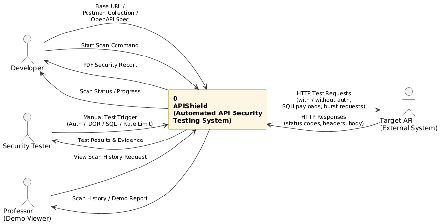
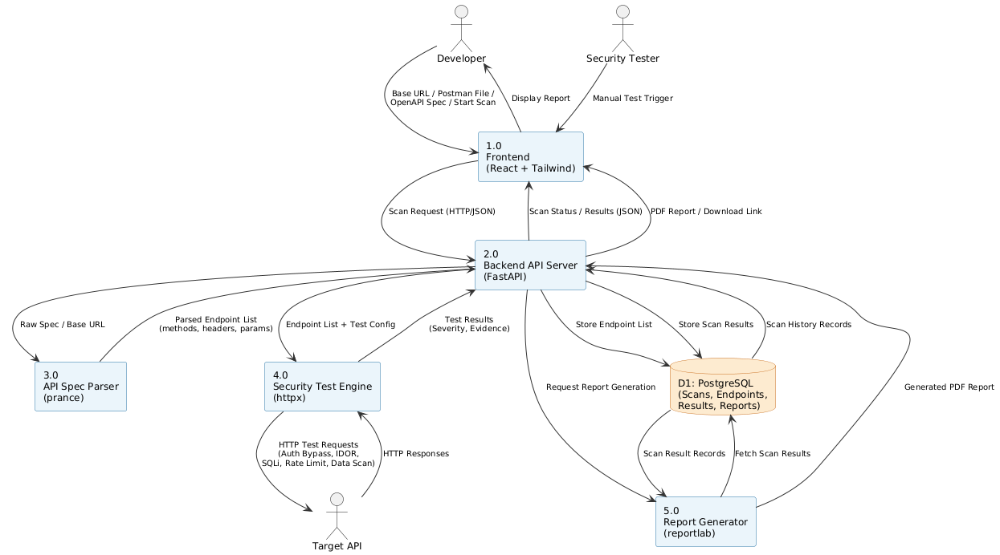
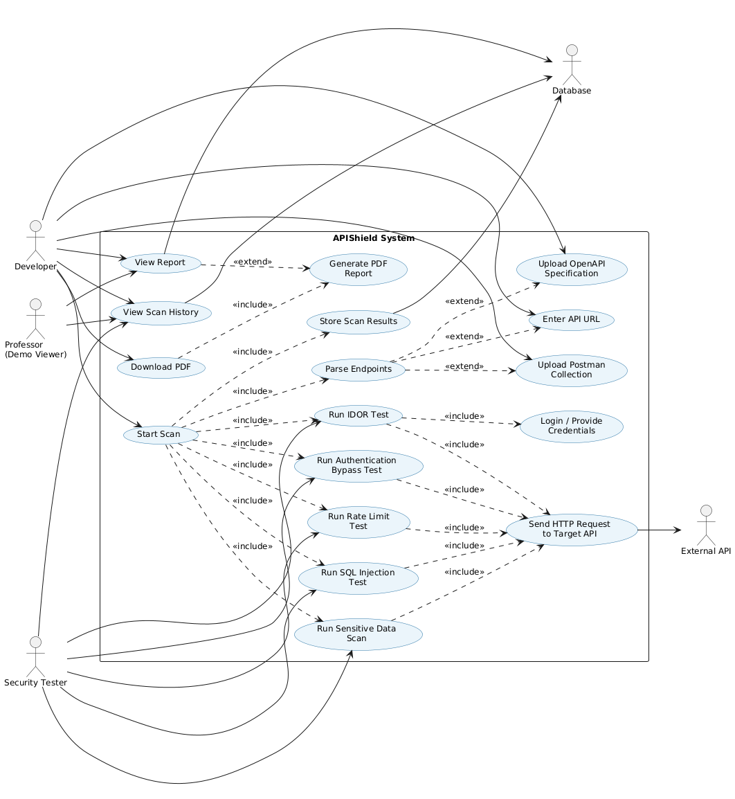
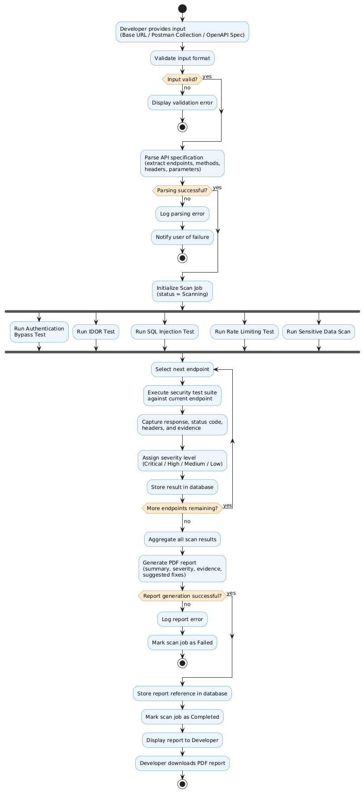
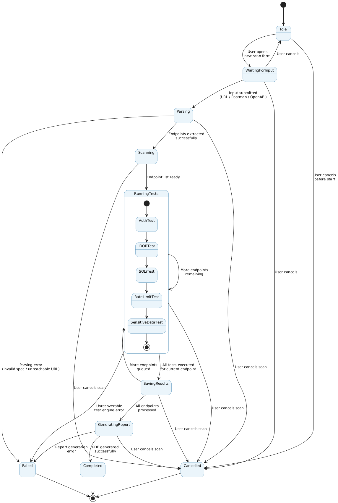
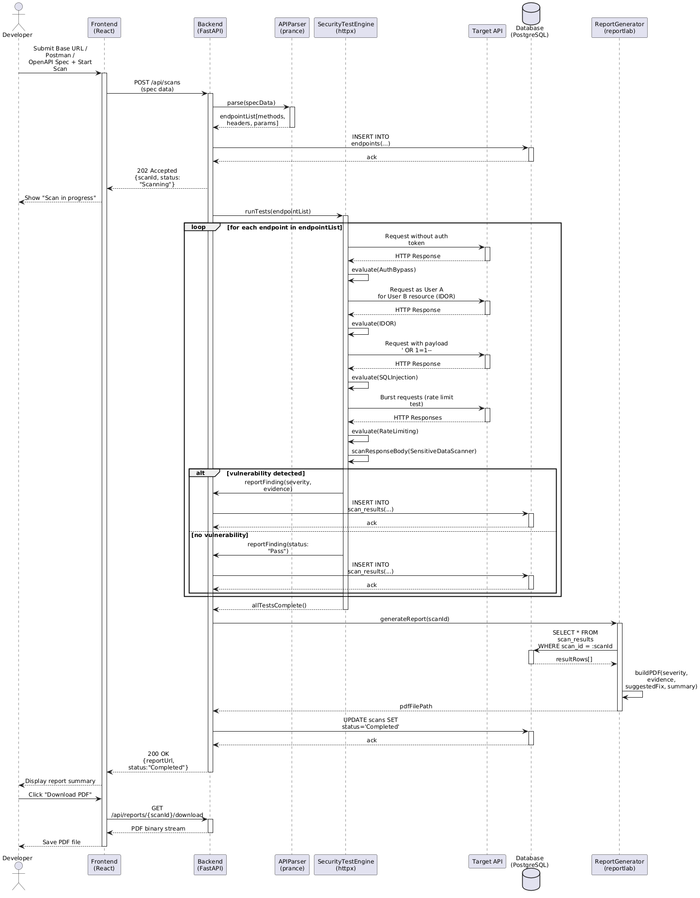
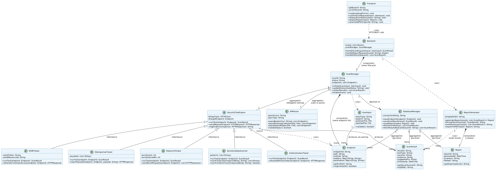

# APIShield: An Automated API Security Testing Tool

**University:** Amrita Vishwa Vidyapeetham
**Course:** 23CCE302 - Software Engineering

**Team Name:** Vantage Security

**Team Members:**
* Poornachandran A
* Samiksha Saravanan
* Keerthi vasan A
* Tharun N V

## Project Description
APIShield is an application that offers security to developers. Instead of carrying out the test on the endpoints manually, the user gives the tool an API URL, Postman collection, or OpenAPI spec. Once the tool gets all the required endpoints, it starts to scan the API using various automated security scans, such as authentication bypass, IDOR, SQL injections, rate limits, and sensitive data exposure. All this information is provided in a downloadable PDF file.

---

## SWE Assignment 1 Diagrams
## 01 DFD Level 0 Context

## 02 DFD Level 1

## 03 Use Case Diagram

## 04 Activity Diagram

## 05 State Diagram

## 06 Sequence Diagram

## 07 Class Diagram

